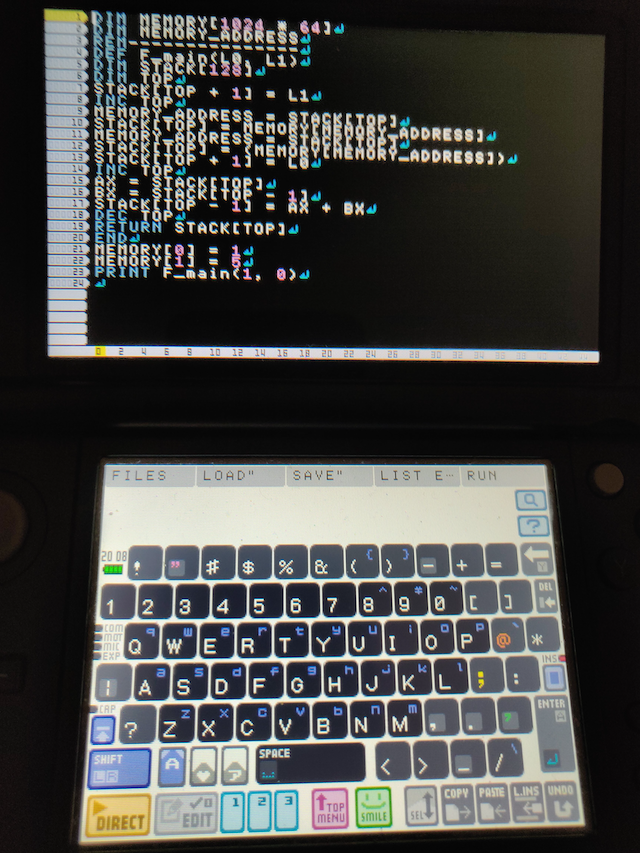

# Emsmilen
A quick hack on top of SmileBASIC for the 3DS, a lot like Emscripten

 

It uses WebAssembly disassemblies (compiled with Emscripten and disassembled with Bynarien), and after a quick tweak,
generates BASIC equivalent code, to be used inside SmileBASIC programs, meant to run on the Nintendo 3DS.3DS

This allows for C++ code to be ported to the 3DS in a 100% legal form.

Project status:
This is a proof of concept (and a quick hack), so only the basics are supported:
- importing functions
- pointer handling
- function calls
- for loops
- while loops
- if then else
- returning values
- returning void

Whats not supported:
- unsigned values
- values bigger than byte
- polymorphism (in fact, most of C++ advanced features)
- function pointers (just like polymorphism, it requires jump tables)